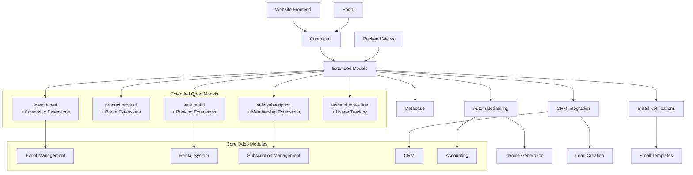
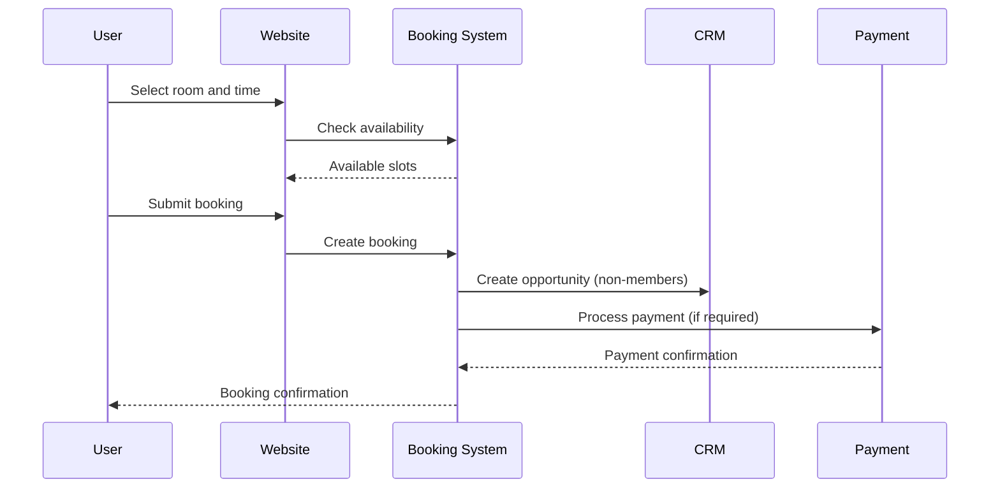
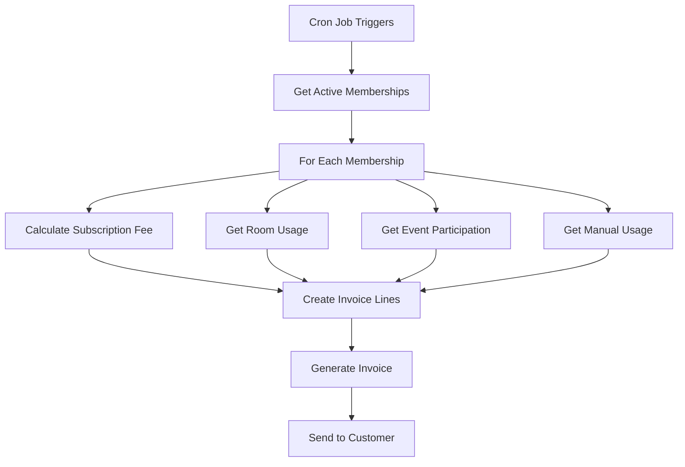

# Coworking Space Management System

## Overview

This Odoo addon provides a comprehensive solution for managing coworking spaces by **extending existing Odoo modules** rather than creating custom implementations. The system leverages Odoo's built-in Event Management, Rental System, Subscription Management, and CRM modules to provide a robust coworking space solution with membership management, room booking, event registration, and automated billing.

## Features

### 🏢 Membership Management (Using Odoo Subscription Module)
- **Leverages `sale_subscription`**: Extends Odoo's subscription system for memberships
- **Multiple Subscription Plans**: Unlimited (€20/month), Partial (€5/month), Pay-As-You-Go (€10 for 10 hours)
- **Automated Membership Lifecycle**: Built on Odoo's subscription lifecycle
- **Credit-based System**: Custom extension for Pay-As-You-Go plans
- **Member Portal**: Extends Odoo's portal system

### 🏠 Meeting Room Booking (Using Odoo Rental Module)
- **Leverages `sale_renting`**: Extends Odoo's rental system for room bookings
- **Real-time Availability**: Built on Odoo's rental availability engine
- **Multi-user Access**: Both members and non-members can book rooms
- **Automated Pricing**: Different rates based on membership type
- **CRM Integration**: Automatic opportunity creation for non-member bookings using Odoo CRM
- **Calendar Integration**: Uses Odoo's calendar system

### 🎉 Event Management (Using Odoo Event Module)
- **Leverages `event` + `website_event`**: Extends Odoo's event management system
- **Event Registration**: Built on Odoo's event registration system
- **Member Benefits**: Custom pricing logic for members vs non-members
- **Capacity Management**: Uses Odoo's seat management
- **Email Notifications**: Leverages Odoo's email template system

### 💰 Automated Billing
- **Monthly Invoice Generation**: Automated billing on the 1st of each month
- **Variable Billing**: Based on actual usage (meeting rooms, events, manual entries)
- **Multiple Revenue Streams**: Subscription fees, room bookings, event fees
- **Usage Tracking**: Detailed tracking of all billable activities

### 🌐 Website Integration
- **Public Booking Interface**: Non-members can book rooms and register for events
- **Member Portal**: Dedicated portal for members with usage statistics
- **Payment Integration**: Stripe integration for online payments
- **Responsive Design**: Mobile-friendly interface

## System Architecture (Leveraging Existing Odoo Modules)



## Module Extension Strategy

Instead of creating custom models from scratch, this addon **extends existing Odoo functionality**:

### 1. **Membership Management** → `sale_subscription`
- Extend `sale.subscription` model for membership plans
- Add custom fields for coworking-specific features (credit balance, access levels)
- Leverage existing subscription lifecycle and billing

### 2. **Meeting Room Booking** → `sale_renting`
- Extend `product.product` for meeting rooms
- Use `sale.rental` for booking management
- Add coworking-specific pricing logic and member/non-member handling

### 3. **Event Management** → `event` + `website_event`
- Extend `event.event` for coworking events
- Leverage existing registration system
- Add member pricing and access control

### 4. **CRM Integration** → `crm`
- Use existing `crm.lead` for non-member opportunities
- Automatic lead creation for non-member bookings

### 5. **Billing** → `account`
- Leverage existing invoice generation
- Extend with coworking-specific billing logic

## Data Model (Extended Odoo Models)

### Extended Entities

1. **Membership Plans** → `sale.subscription.template`
   - **Extends**: Odoo's subscription template system
   - **Adds**: Coworking access levels, credit allocation, member benefits
   - **Leverages**: Existing pricing, billing cycles, and lifecycle management

2. **Memberships** → `sale.subscription`
   - **Extends**: Odoo's subscription system
   - **Adds**: Credit balance tracking, coworking-specific states
   - **Leverages**: Auto-renewal, payment processing, invoice generation

3. **Meeting Rooms** → `product.product`
   - **Extends**: Odoo's product system with rental capabilities
   - **Adds**: Room-specific fields (capacity, equipment, availability)
   - **Leverages**: Existing product management, pricing, and inventory

4. **Room Bookings** → `sale.rental`
   - **Extends**: Odoo's rental system
   - **Adds**: Member vs non-member logic, coworking-specific workflows
   - **Leverages**: Availability checking, pricing, and order management

5. **Events** → `event.event`
   - **Extends**: Odoo's event management system
   - **Adds**: Member pricing, coworking-specific registration logic
   - **Leverages**: Registration management, capacity control, email notifications

6. **Event Registrations** → `event.registration`
   - **Extends**: Odoo's event registration system
   - **Adds**: Member identification, custom pricing logic
   - **Leverages**: Payment processing, confirmation emails

7. **Usage Tracking** → `account.analytic.line`
   - **Extends**: Odoo's analytic accounting for usage tracking
   - **Adds**: Coworking-specific usage types and billing integration
   - **Leverages**: Time tracking, cost allocation, reporting

## Installation Guide

### Prerequisites
- Odoo 18.0 or later
- Python 3.8+
- PostgreSQL 12+

### Installation Steps

1. **Copy the addon to your Odoo addons directory:**
   ```bash
   cp -r coworking_space /path/to/odoo/addons/
   ```

2. **Update the addons list:**
   ```bash
   ./odoo-bin -u all -d your_database
   ```

3. **Install the addon:**
   - Go to Apps menu in Odoo
   - Search for "Coworking Space Management"
   - Click Install

4. **Configure the system:**
   - Set up membership plans
   - Create rooms and equipment
   - Configure email templates
   - Set up payment providers (for Stripe integration)

### Dependencies
The addon **extends** the following existing Odoo modules:
- `base` - Core Odoo functionality
- `website` - Website framework
- `website_sale` - E-commerce functionality
- `website_event` - **Event management (LEVERAGED for events)**
- `sale` - Sales management
- `sale_subscription` - **Subscription management (LEVERAGED for memberships)**
- `sale_renting` - **Rental system (LEVERAGED for meeting room bookings)**
- `account` - Accounting
- `crm` - **Customer relationship management (LEVERAGED for non-member leads)**
- `event` - **Event management core (LEVERAGED)**
- `portal` - Customer portal
- `payment` - Payment processing
- `resource` - Resource management for rooms
- `calendar` - Calendar integration

## Configuration

### 1. Membership Plans Setup
Navigate to **Coworking → Configuration → Membership Plans** and configure:
- Plan names and codes
- Monthly pricing
- Access levels for each service type
- Credit amounts for Pay-As-You-Go plans

### 2. Room Configuration
Go to **Coworking → Configuration → Rooms** and set up:
- Room details (name, capacity, location)
- Equipment and amenities
- Availability schedules
- Hourly rates

### 3. Email Templates
Configure email templates in **Settings → Technical → Email Templates**:
- Booking confirmation emails
- Event registration confirmations
- Monthly invoice notifications

### 4. Payment Configuration
Set up payment providers in **Website → Configuration → Payment Providers**:
- Configure Stripe for online payments
- Set up payment methods for different services

## Usage Guide

### For Administrators

#### Managing Memberships
1. **Create New Membership:**
   - Go to Coworking → Memberships
   - Click Create and select partner and plan
   - Set start date and activate

2. **Monitor Usage:**
   - View usage statistics in member profiles
   - Track credit balances for Pay-As-You-Go members
   - Generate usage reports

#### Room Management
1. **Add New Rooms:**
   - Go to Coworking → Configuration → Rooms
   - Set capacity, equipment, and availability
   - Upload room images

2. **Monitor Bookings:**
   - View booking calendar
   - Approve/reject non-member bookings
   - Handle cancellations and refunds

#### Event Management
1. **Create Events:**
   - Go to Coworking → Events
   - Set event details, capacity, and pricing
   - Publish to website

2. **Manage Registrations:**
   - Monitor registration numbers
   - Process payments
   - Send event updates

#### Billing Management
1. **Generate Monthly Invoices:**
   - Go to Coworking → Billing → Generate Invoices
   - Select period and options
   - Review and validate invoices

2. **Track Revenue:**
   - Monitor subscription revenue
   - Analyze room booking income
   - Track event participation fees

### For Members

#### Using the Portal
1. **Access Member Portal:**
   - Login to website
   - Navigate to "My Account" → "Coworking"

2. **Book Meeting Rooms:**
   - View available rooms
   - Select time slots
   - Confirm bookings

3. **Register for Events:**
   - Browse upcoming events
   - Register with member pricing
   - View registration history

4. **Track Usage:**
   - View current month usage
   - Check credit balance (Pay-As-You-Go)
   - Add manual usage entries

### For Non-Members

#### Booking Services
1. **Room Booking:**
   - Visit coworking website
   - Select room and time slot
   - Provide contact information
   - Complete payment

2. **Event Registration:**
   - Browse public events
   - Register and pay online
   - Receive confirmation email

## API Endpoints

### Public API
- `GET /coworking/api/room/availability` - Check room availability
- `POST /coworking/api/booking/create` - Create new booking
- `GET /coworking/api/room/slots` - Get available time slots

### Member API
- `POST /coworking/api/event/register` - Register for events
- `POST /coworking/api/booking/cancel` - Cancel bookings
- `POST /coworking/api/booking/reschedule` - Reschedule bookings

## Development Process

### 1. Requirements Analysis ✅
- Analyzed PDF requirements document
- Identified core features and user stories
- Defined technical architecture

### 2. Model Design ✅
- Created comprehensive data models
- Implemented business logic and constraints
- Added computed fields and automation

### 3. Controller Development ✅
- Built website controllers for public access
- Implemented portal controllers for members
- Created API endpoints for AJAX functionality

### 4. Security Implementation ✅
- Defined user groups and access rights
- Implemented record-level security rules
- Protected sensitive operations

### 5. Integration ✅
- Integrated with existing Odoo modules
- Implemented automated billing system
- Added CRM opportunity creation

### 6. Testing & Documentation ✅
- Created comprehensive documentation
- Provided installation and usage guides
- Documented API endpoints

## Customization

### Adding New Membership Plans
1. Create new plan record in `coworking.membership.plan`
2. Define access levels and pricing
3. Update website templates if needed

### Custom Room Types
1. Extend `coworking.room` model
2. Add new fields for specific requirements
3. Update booking logic if necessary

### Additional Services
1. Create new models for services
2. Integrate with billing system
3. Add to member portal

## Troubleshooting

### Common Issues

1. **Booking Conflicts:**
   - Check room availability logic
   - Verify datetime handling
   - Review booking state management

2. **Payment Issues:**
   - Verify payment provider configuration
   - Check webhook endpoints
   - Review transaction logs

3. **Email Notifications:**
   - Verify SMTP configuration
   - Check email template syntax
   - Review mail server logs

### Support

For technical support and customization requests:
- Email: support@luminouslabsbd.com
- Documentation: [Internal Wiki]
- Issue Tracker: [GitHub Repository]

## License

This addon is licensed under LGPL-3. See LICENSE file for details.

## Technical Implementation Details

### Database Schema

#### Membership Management
```sql
-- Core membership tables
coworking_membership_plan (id, name, code, monthly_price, access_levels)
coworking_membership (id, partner_id, plan_id, state, credit_balance)
```

#### Booking System
```sql
-- Room and booking tables
coworking_room (id, name, capacity, hourly_rate, availability_schedule)
coworking_booking (id, room_id, partner_id, start_datetime, end_datetime, state)
```

#### Event Management
```sql
-- Event tables
coworking_event (id, name, date_begin, date_end, seats_max, pricing)
coworking_event_registration (id, event_id, partner_id, state, price)
```

### Business Logic Flow

#### Booking Process


#### Monthly Billing Process


### Performance Considerations

#### Database Optimization
- Indexed fields: `partner_id`, `start_datetime`, `state`
- Computed fields with `store=True` for frequently accessed data
- Proper foreign key relationships with `ondelete` constraints

#### Caching Strategy
- Room availability cached for 5 minutes
- Membership data cached per session
- Event data cached until modification

#### Scalability Features
- Pagination for large datasets
- Lazy loading for related records
- Efficient search domains

### Security Implementation

#### Access Control
```python
# Record rules example
domain_force = [
    '|',
    ('partner_id.user_ids', 'in', user.id),
    ('create_uid', '=', user.id)
]
```

#### Data Protection
- Partner data accessible only to owners
- Booking data filtered by user access
- Payment information encrypted

### Integration Points

#### CRM Integration
- Automatic lead creation for non-member bookings
- Opportunity tracking for upselling
- Customer journey mapping

#### Accounting Integration
- Automated invoice generation
- Revenue recognition by service type
- Tax calculation and compliance

#### Website Integration
- SEO-optimized pages
- Mobile-responsive design
- Progressive web app features

### Monitoring and Analytics

#### Key Metrics
- Room utilization rates
- Member retention rates
- Revenue per member
- Booking conversion rates

#### Reporting Features
- Monthly revenue reports
- Usage analytics
- Member activity dashboards
- Operational efficiency metrics

### Deployment Checklist

#### Pre-deployment
- [ ] Database backup
- [ ] Test environment validation
- [ ] Security audit
- [ ] Performance testing

#### Post-deployment
- [ ] Monitor error logs
- [ ] Verify email delivery
- [ ] Test payment processing
- [ ] User acceptance testing

### Maintenance Tasks

#### Daily
- Monitor booking conflicts
- Check payment processing
- Review error logs

#### Weekly
- Generate usage reports
- Update room availability
- Process refunds

#### Monthly
- Generate invoices
- Analyze performance metrics
- Update membership statuses

---

**Developed by Luminous Labs BD**
*Empowering businesses with innovative technology solutions*
